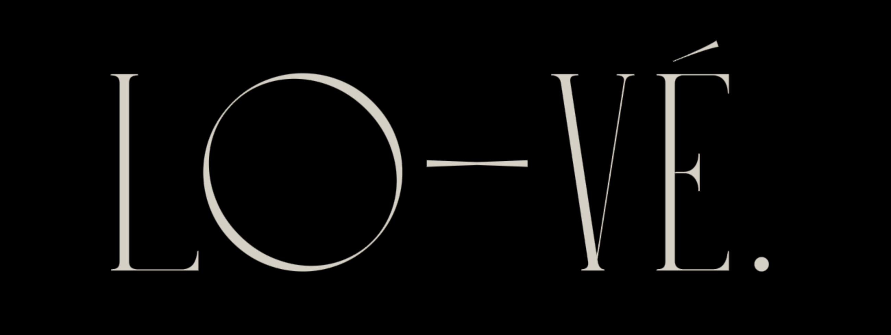

# three-glyph

<p>
  <a href="https://www.npmjs.com/package/three-glyph"></a>
  <a href="https://www.npmjs.com/package/three-glyph"></a>
  <a href="https://github.com/trinketmage/three-glyph/issues"></a>
  <a href="https://github.com/trinketmage/three-glyph/blob/main/LICENSE"></a>
  <a href="https://twitter.com/remuemeninge"></a>
</p>

[](https://three-glyph-examples.web.app/)

MSDF Bitmap Fonts implementation for three.js.

ES6 adaptation of [three-bmfont-text](https://github.com/Experience-Monks/three-bmfont-text) and more..

## Context
While [creating text](https://threejs.org/docs/#manual/en/introduction/Creating-text) in [three.js](https://threejs.org/docs/?q=text#examples/en/geometries/TextGeometry) is straightforward, achieving both high fidelity and good performance can prove to be a complex task.

Signed Distance Fields (SDF) are a method of reproducing vector shapes from a texture representation, popularized in [this paper by Valve](https://steamcdn-a.akamaihd.net/apps/valve/2007/SIGGRAPH2007_AlphaTestedMagnification.pdf). The integration of signed distance fields into [AngelCode BMFont files](https://www.angelcode.com/products/bmfont/) enables developers to create high-quality bitmap fonts with smooth, scalable outlines in a wide range of applications, offering both performance and visual fidelity benefits.

While SDFs offer efficient and high-quality rendering of simple shapes, Multi-channel Signed Distance Fields (MSDF) extend this capability to capture intricate details and sharp features in complex shapes, making them suitable for a wider range of applications, including text rendering, iconography, and graphic design.
To learn more about MSDFs you can read [Viktor Chlumský Master's thesis](https://github.com/Chlumsky/msdfgen/files/3050967/thesis.pdf) and check out [his github](https://github.com/Chlumsky/msdfgen).

## Demo
 * [Basic](https://codepen.io/trinketmage/full/NWJJQWJ)
 * [Font atlas previewer](https://codepen.io/trinketmage/pen/KKEGOjx)
 * [Animation example](https://thre-glyph-animate-tool.web.app/)

### Advanced
 * [Per index](https://codepen.io/trinketmage/full/yLwwwKr)

## Getting Started
```sh
npm install -S three-glyph
```

## Usage

### Basic
#### Load the font
```js
  import * as THREE from "three";
  import { FontLoader } from 'three/examples/jsm/loaders/FontLoader.js';
  import { Glyph } from "three-glyph";
  
  const manager = new THREE.LoadingManager();
  const fontLoader = new FontLoader(manager);
  const textureLoader = new THREE.TextureLoader(manager);

  const font = null;
  fontLoader.load(
    './Roboto-Regular.json',
    ( raw ) => { font = raw.data }
  );
  const texture = this.textureLoader.load( "./Roboto-Regular.png");
  
  manager.onLoad = function() {
    // Draw glpyhs
  };
```
#### Draw glyphs
```js
  const glyph = new Glyph({
    text: 'Hello world',
    font,
    map: texture
  });
  scene.add(glyph);
```

The class `Glyph` extends the class [`Object3D`](https://threejs.org/docs/?q=Object3D#api/en/core/Object3D).

### Properties
- **`text` (required)**
The text to layout. Newline characters (\n) will cause line breaks.
- **`font` (required)**
The BMFont definition which holds chars, kernings, etc..
- **`map` (required)**
The texture atlas containing our glyphs.
- **`width`**
The desired width of the text box, causes word-wrapping and clipping in "pre" mode. Leave as undefined to remove word-wrapping (default behaviour).
- **`letterSpacing`**
The letter spacing in pixels (default: `0`).
- **`lineHeight`**
The line height in pixels (default to `font.common.lineHeight`).
- **`textAlign`**
The horizontal alignment of each line of text within the overall text bounding box. Can be one of `left`, `right` or `center`.

## Roadmap
 * [x] Basic GlyphGeometry
 * [x] Fix drawing vertices order
 * [x] Basic GlyphShader
 * [x] Basic GlyphMaterial
 * [x] Basic Glyph (Mesh)
 * [x] Glyph [anchorX and anchorY](https://protectwise.github.io/troika/troika-three-text/#anchorx)
 * [x] How to debug example
 * [x] Shader "chunkification"
 * [ ] Handles per lines and per character's index
 * [x] API animation per character
 * [ ] API animation per line
 * [ ] Example with custom map texture (video)
 * [ ] Example with [alphaMap per character](https://thre-glyph-animate-tool.web.app/) example with tutorial.
 * [ ] Right-to-left layout
 * [ ] Responsive : html context mirror layout
 * [ ] How to generate a MSDF Bitmap font
 * [ ] Font tweakings process
 * [ ] [MTSDF support](https://github.com/Chlumsky/msdf-atlas-gen?tab=readme-ov-file) ([it's a real thing](https://pixijs.download/dev/docs/PIXI.BitmapText.html)), [rust doc](https://docs.rs/msdf/latest/msdf/struct.MTSDF.html), [rust quoting Chlumsky](https://docs.rs/msdf-sys/latest/msdf_sys/), [article](https://badecho.com/index.php/2023/09/24/msdf-fonts/)
* [ ] Documentation
 * [x] Normal compute fix
 * [x] LineHeight bug fix
 * [x] Negate map support
* [ ] Writing the history of text rendering (resources are welcome at tranremi@live.fr).

## License

[GPLv3](https://www.gnu.org/licenses/gpl-3.0.html)

Copyright (c) 2024-present, Rémi Tran
